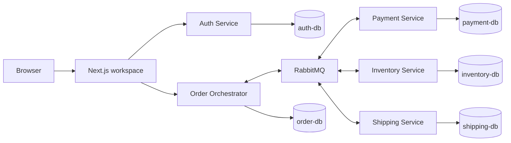

# Final architecture

## Components and ownership



Each service owns its database. No service reads or writes another service's tables. The browser communicates only with the Next.js application; it never receives database credentials, RabbitMQ credentials, or the backend bearer token.

## Order flow

```mermaid
sequenceDiagram
  participant U as Signed-in user
  participant W as Next.js API proxy
  participant O as Order Orchestrator
  participant R as RabbitMQ
  participant P as Payment
  participant I as Inventory
  participant S as Shipping
  U->>W: POST /api/orders
  W->>W: Verify session; attach user ID and role
  W->>O: Accepted order with idempotency key
  O->>R: Charge payment command (outbox)
  R->>P: Charge payment
  P-->>R: Result
  O->>R: Reserve inventory command
  R->>I: Reserve locked stock
  I-->>R: Result
  O->>R: Create shipment command
  R->>S: Create shipment
  S-->>R: Result
  O-->>W: Current Saga state
```

On a failure, the orchestrator sends compensating commands in reverse completed order: cancel shipment, release stock, and refund payment. Compensation is a new idempotent business operation, not a database rollback.

## Reliability rules

- HTTP submissions use an idempotency key; duplicate submissions return the persisted order.
- Every service uses inbox/receipt records to make at-least-once RabbitMQ delivery safe.
- Transactional outboxes commit state and outgoing messages together; relay/recovery workers publish later if needed.
- Inventory locks product rows during reservation, so a stale stock display cannot oversell.
- The orchestrator persists every Saga transition and resumes unfinished work after recovery.

## Catalog and identity

Inventory provides the live catalog (`name`, `SKU`, price, active state, available stock). The order service recalculates the trusted order total. Auth owns users, sessions, email-verification tokens, password-reset tokens, rate-limit records, and audit logs. Customer identity comes only from the verified server-side session; customers can access their own orders, while administrators may view attention items, resume Sagas, and confirm bank transfers.
